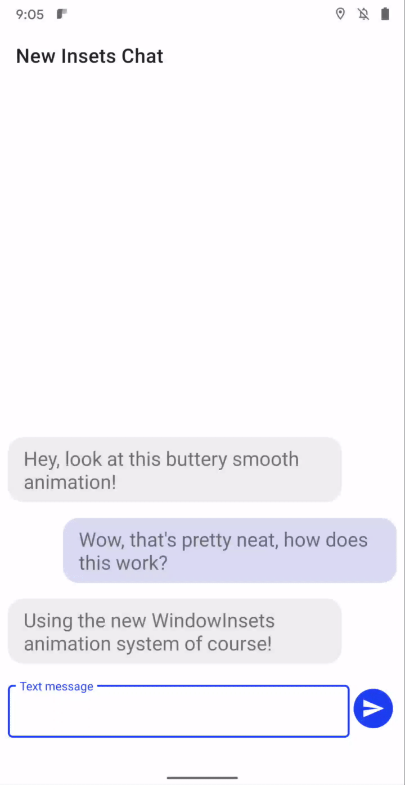
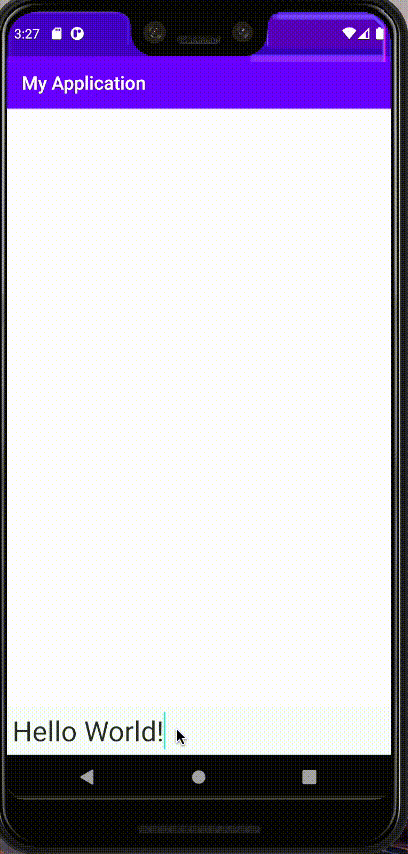

# WindowInsets - 获取导航栏，状态栏，键盘的高度和状态
## 背景
最新的 Android Q（11） 推出了许多功能，有一个比较重要的功能（需梯子）：
[Synchronized IME transitions](https://android-developers.googleblog.com/2020/03/android-11-developer-preview-2.html)

> A new set of APIs let you synchronize your app’s content with the IME (input method editor, aka soft keyboard) and system bars as they animate on and offscreen, making it much easier to create natural, intuitive and jank-free IME transitions. For frame-perfect transitions, a new insets animation listener notifies apps of per-frame changes to insets while the system bars or the IME animate. Additionally, apps can take control of the IME and system bar transitions through the WindowInsetsAnimationController API. For example, app-driven IME experiences let apps control the IME in response to overscrolling the app UI. Give these new IME transitions a try and let us know what other transitions are important to you.

按照文章的意思，可以监听键盘的高度变化，光介绍就非常让人激动人心.
<br>凡是搞过键盘的同学都知道，监听 Android 键盘的高度非常复杂，网上的一些黑科技也只对某些场景，有些场景就是无法处理。
<br>而且有一个非常关键的点：键盘只有完全弹出来了才知道高度，当我们想根据键盘的上升做一个动画时，就很难做到-<b>无法知道键盘动画的时间和最终高度</b>

我们来看看官方给的效果图：



话不多说，我们来测试一下

## 测试
### 引入
1. 前期准备
<br>先将 Android Studio 和 Gradle， Android SDK 更新到最新, 我的版本分别是：
Android Studio 3.6.1， Gradle 5.6.4, Android SDK R

<br>有 Pixel 手机的直接更新到最新版本 Q ，没有的可以下载最新的 Q 镜像

2. 更新 gradle 配置

```
android {
    compileSdkVersion 'android-R'
    buildToolsVersion "29.0.2"

    defaultConfig {
        applicationId "com.example.myapplication"
        minSdkVersion 'R'
        targetSdkVersion 'R'
        versionCode 1
        versionName "1.0"

        testInstrumentationRunner "androidx.test.runner.AndroidJUnitRunner"
    }

    //....

}
```

### 使用
1. 先设置 FitSystemWindows 为 false：

```kotlin
 //非常重要，没有这句话监听无法生效
window.setDecorFitsSystemWindows(false)
```

2. 再对 view 设置监听：

```kotlin
class MainActivity : AppCompatActivity() {

    override fun onCreate(savedInstanceState: Bundle?) {
        super.onCreate(savedInstanceState)
        //非常重要，没有这句话监听无法生效
        window.setDecorFitsSystemWindows(false)
        setContentView(R.layout.activity_main)
        val callback = object : WindowInsetsAnimation.Callback(DISPATCH_MODE_CONTINUE_ON_SUBTREE) {
            override fun onProgress(
                insets: WindowInsets,
                animations: MutableList<WindowInsetsAnimation>
            ): WindowInsets {
                Log.e("MainActivity", "ime:" + insets.getInsets(WindowInsets.Type.ime()).top +
                            " " + insets.getInsets(WindowInsets.Type.ime()).bottom)
                return insets
            }
        }
        content.setWindowInsetsAnimationCallback(callback)
    }
}
```

运行结果：

```
MainActivity: ime:0 0
MainActivity: ime:0 0
MainActivity: ime:0 9
MainActivity: ime:0 37
MainActivity: ime:0 98
MainActivity: ime:0 207
MainActivity: ime:0 351
MainActivity: ime:0 526
MainActivity: ime:0 684
MainActivity: ime:0 799
MainActivity: ime:0 895
MainActivity: ime:0 1020
MainActivity: ime:0 1062
MainActivity: ime:0 1095
MainActivity: ime:0 1117
MainActivity: ime:0 1134
MainActivity: ime:0 1146
MainActivity: ime:0 1152
MainActivity: ime:0 1155
```

可以看到很清晰的打印出了键盘的每一帧高度，这样我们就可以根据高度回调，实现文章开头的效果

对比微信键盘弹出和 Android Q 的键盘弹出，可以看到微信的上升和下降，都不是完全吻合，但是 Android Q 一直是稳稳的贴着：



### 详细代码


```kotlin
class MainActivity : AppCompatActivity() {
    override fun onCreate(savedInstanceState: Bundle?) {
        super.onCreate(savedInstanceState)
        //非常重要，没有这句话监听无法生效
        window.setDecorFitsSystemWindows(false)
        setContentView(R.layout.activity_main)
        val callback = object : WindowInsetsAnimation.Callback(DISPATCH_MODE_CONTINUE_ON_SUBTREE) {
            override fun onProgress(
                insets: WindowInsets,
                animations: MutableList<WindowInsetsAnimation>
            ): WindowInsets {
             val navigationBars = insets.getInsets(WindowInsets.Type.navigationBars())
                             val ime = insets.getInsets(WindowInsets.Type.ime())
                             Log.e(
                                 TAG, "ime:" + ime.top +
                                         " " + ime.bottom
                             )
                             val parmas = (content.layoutParams as ViewGroup.MarginLayoutParams)
                             parmas.bottomMargin = ime.bottom - navigationBars.bottom
                             content.layoutParams = parmas
                             return insets
                return insets
            }
        }
        content.setWindowInsetsAnimationCallback(callback)
    }
}
```

## 分析

除了上面例子用到的 onProgress() 方法，WindowInsetsAnimation.Callback 还有其他的属性和方法值得关注：

1. 分发方式

构造 WindowInsetsAnimation.Callback(int) 传入一个int 值表示分发方式，目前有两个值：

* DISPATCH_MODE_CONTINUE_ON_SUBTREE ：继续分发动画事件
* DISPATCH_MODE_STOP ：不再分发

这两个值和 view 的事件分发很类似，这里就不多解释了。

2. 键盘弹出的开始和结束

假设需求仅仅是想获取键盘的高度，不需要实时获取高度变化，可以重写 start() 方法

```
val callback = object : WindowInsetsAnimation.Callback(DISPATCH_MODE_CONTINUE_ON_SUBTREE) {
            override fun onStart(
                animation: WindowInsetsAnimation,
                bounds: WindowInsetsAnimation.Bounds
            ): WindowInsetsAnimation.Bounds {
                Log.e(TAG,"start lowerBound:" + bounds.lowerBound.top + " " + bounds.lowerBound.bottom)
                Log.e( TAG,"start upperBound:" + bounds.upperBound.top + " " + bounds.upperBound.bottom)
                Log.e(TAG, "start time:" + animation.durationMillis)
                return super.onStart(animation, bounds)
            }
        }
```

其中 bounds 表示目标对象，从里面可以拿到动画结束后键盘有多高。
<br>animation 中可以获取动画的执行时间，透明度等等。

## 导航栏，状态栏高度和状态

获取高度之前先来了解一下 WindowInsets.Type 有什么类型，上面我们用到了 ime() 是键盘，除了键盘，还有其他的类型，包括：

```
android.view.WindowInsets.Type.STATUS_BARS, //状态栏
android.view.WindowInsets.Type.NAVIGATION_BARS, //导航栏
android.view.WindowInsets.Type.CAPTION_BAR,
android.view.WindowInsets.Type.IME, //键盘
android.view.WindowInsets.Type.WINDOW_DECOR,
android.view.WindowInsets.Type.SYSTEM_GESTURES,
android.view.WindowInsets.Type.MANDATORY_SYSTEM_GESTURES,
and android.view.WindowInsets.Type.TAPPABLE_ELEMENT
```

类型很多，我们通常关心键盘，状态栏和导航栏

### 获取高度和状态

在 Android Q 之前，获取状态栏高度通常是通过反射获取。但是有了 WindowInsets 就不用这么麻烦了：

```
content.setOnApplyWindowInsetsListener { view, windowInsets ->
    //状态栏
    val statusBars = windowInsets.getInsets(WindowInsets.Type.statusBars())
    //导航栏
    val navigationBars = windowInsets.getInsets(WindowInsets.Type.navigationBars())
    //键盘
    val ime = windowInsets.getInsets(WindowInsets.Type.ime())
    windowInsets
}
```

上面代码可以获取导航栏和状态栏的高度，假设要获取隐藏和显示，可以通过：

```
//注意：setOnApplyWindowInsetsListener 一设置监听就会回调，此时获取的 navigationBars 是否可见是 false
//等绘制完成再去获取就是 true，这个稍微比较坑一点
windowInsets.isVisible(WindowInsets.Type.navigationBars())
```

### 控制各种状态栏的显示和隐藏

在 Q 之前，控制导航栏和状态，需要用上各种谜之属性：

```
view.systemUiVisibility = View.SYSTEM_UI_FLAG_LAYOUT_STABLE or
                          View.SYSTEM_UI_FLAG_LAYOUT_FULLSCREEN or
                          View.SYSTEM_UI_FLAG_HIDE_NAVIGATION
```

新版是这样的：

```
//对状态栏和键盘也可以同样控制
content.windowInsetsController?.show(WindowInsets.Type.navigationBars())
content.windowInsetsController?.hide(WindowInsets.Type.navigationBars())
```

## 其他

一番测试下来，新版的 API 对于之前来说，可以说是非常好用了。
<br>目前存在以下几个问题：

1. 不支持旧版
<br>如果仅是在 Android Q 上使用，那这个工具就没这么香了，希望能通过 androidx 或 support 方式支持

2. FitSystemWindows
<br>在有虚拟导航栏的手机上，FitSystemWindows 设置为 false，会强制改变 Activity 与导航栏的关系。
<br>默认情况下, Activity 在导航栏的上面，它们处于同一层，但是设置为 false 之后，导航栏会直接覆盖在 Activity 的上面。
不过这可以通过给 Activity 的 parent 设置一个 padding 来解决。

3. 等 Q 发布后，还需要测试国产 ROM，以及第三方键盘的兼容性

## 总结

总的来说这个工具的出现，使获取,管理键盘等 APP 以外的装饰都变得非常友好。
<br>由于 Android Q 现在还是预览版，还没有公布源码，暂时不知道其内部实现原理，等后期公布了源码再分析一下原理


